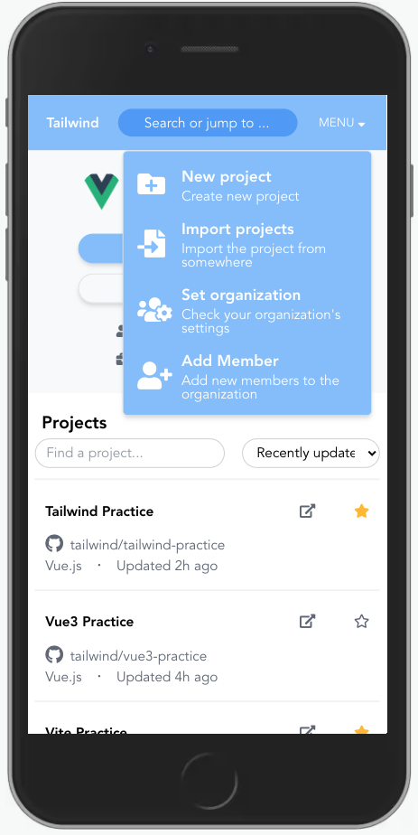

# tailwind-practice
This repository is for practicing Tailwind CSS.

## What did you learn in this repository? 🤔

### Usage of Tailwind CSS

I used tailwind CSS for the first time. Learned about unique class names, variants, and development environment.

The UI I made is introduced [here](#ui_introduction).

### A better way to split Vue components

I used to divide components into very large units, but I learned to divide them into smaller units.

Also, I was not strongly aware of the tree structure until now, but this time I am aware of the tree structure. (But no data is passed in this repository ...)

### Semantic HTML

Until now, I used a lot of div elements and didn't try to convey the meaning of each element.

From this time, I was conscious of the meaning of each element while also learning the basics of HTML.(It was changed from div, div, div ... to header, section, article, aside, footer)

## UI introduction 💻

### Capture of PC size

### Capture of Phone size

## Require 🗝️

| require | version  |
| ------- | -------- |
| node    | v12.18.3 |
| npm     | v7.20.3  |

## How to set up ⚙

1. `git clone https://github.com/k-kudo-hub/tailwind-practice.git`
1. `cd /path/to/tailwind-practice`
1. `npm install`
1. `npm run dev`
